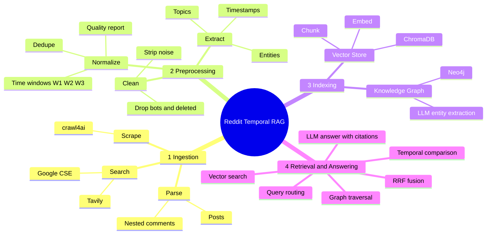
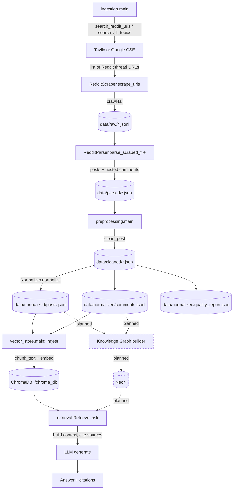
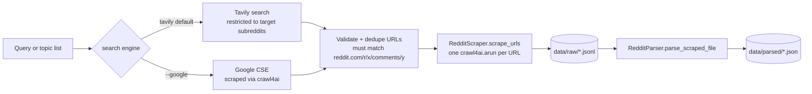
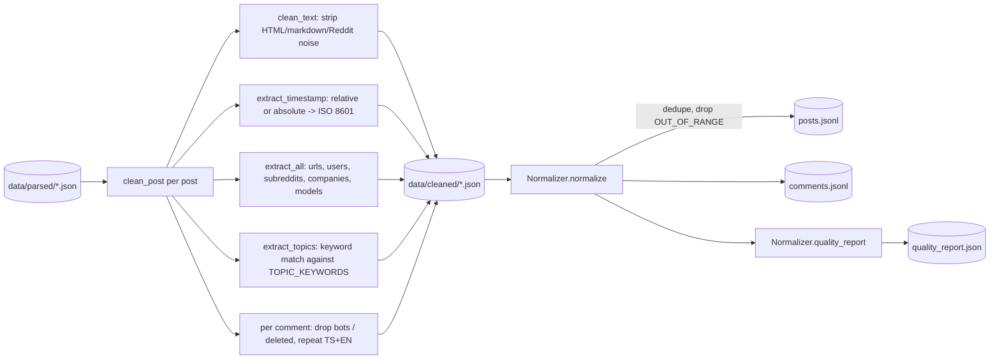
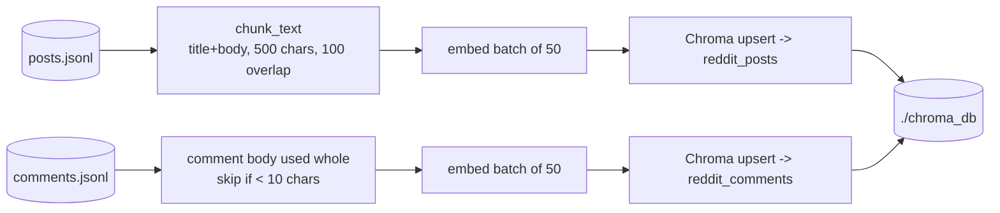
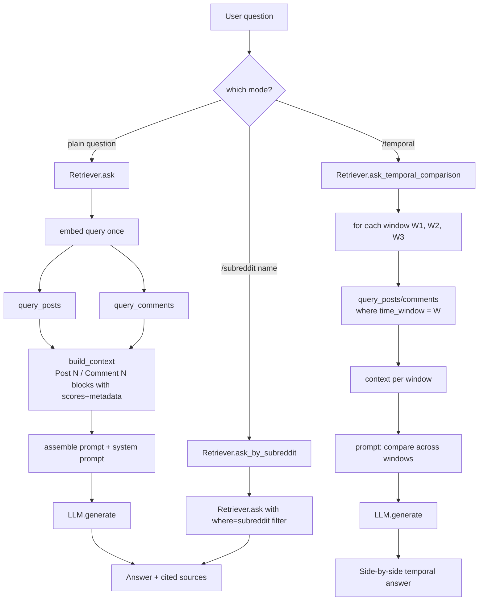
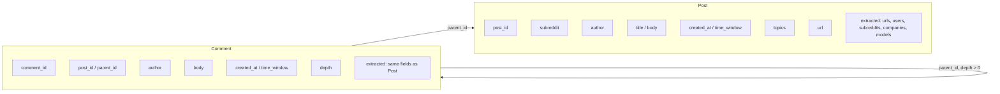
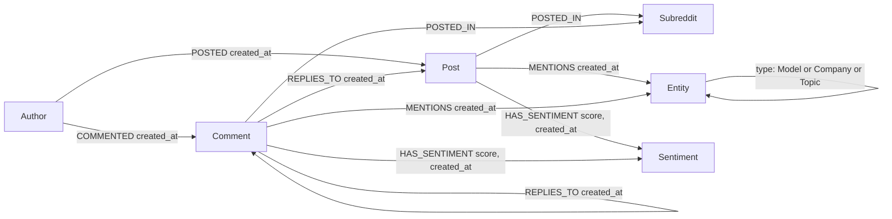

# Reddit Temporal Knowledge RAG

A hybrid retrieval system over Reddit discussions about AI/LLM topics (RAG, AI safety, open-source models, agents, etc.). It scrapes Reddit posts and comments across time windows, builds a vector index of the content, and answers natural-language questions — including questions about how a topic changed over time.

> **Build status:** Ingestion → Preprocessing → Vector Index are implemented and working end-to-end. The Neo4j temporal knowledge graph, the hybrid (graph + vector) fusion layer, and `demo.py` are **in progress / not yet implemented**. This README documents what exists today, exactly how every file fits together, and what's planned next. See [Roadmap](#roadmap--whats-left).

## Table of Contents
- [System Mind Map](#system-mind-map)
- [Architecture (Flow Diagram)](#architecture-flow-diagram)
- [Repository Structure — Every File & Folder Explained](#repository-structure--every-file--folder-explained)
- [Pipeline Flow Diagrams](#pipeline-flow-diagrams)
- [Data Model](#data-model)
- [Tech Stack & Reasoning](#tech-stack--reasoning)
- [Setup (clone → configure → run)](#setup-clone--configure--run)
- [Command Reference — Step by Step](#command-reference--step-by-step)
- [Roadmap / What's Left](#roadmap--whats-left)
- [Known Deviations from the Spec](#known-deviations-from-the-spec)

---

## System Mind Map

The system is four pipeline stages. Each branch below is one stage; leaves are its sub-steps or pluggable backends.



**Status key** — what's wired up today vs. still planned (kept out of the diagram itself to avoid clutter, mapped to the same branches):

| Stage | Sub-step | Status |
|---|---|---|
| 1. Ingestion | Search, Scrape, Parse | ✅ Done |
| 2. Preprocessing | Clean, Extract, Normalize | ✅ Done |
| 3. Indexing | Vector Store | ✅ Done |
| 3. Indexing | Knowledge Graph | 🚧 Planned |
| 4. Retrieval & Answering | Vector search, LLM answer, Temporal comparison | ✅ Done |
| 4. Retrieval & Answering | Graph traversal, RRF fusion, Query routing | 🚧 Planned |

<details>
<summary>Plain-text fallback (if your viewer doesn't render Mermaid)</summary>

```
Reddit Temporal RAG
├── 1. Ingestion                         [done]
│   ├── Search        → Tavily / Google CSE
│   ├── Scrape         → crawl4ai
│   └── Parse           → posts + nested comments
├── 2. Preprocessing                     [done]
│   ├── Clean           → strip noise, drop bots/deleted
│   ├── Extract          → timestamps, entities, topics
│   └── Normalize        → dedupe, time windows, quality report
├── 3. Indexing
│   ├── Vector Store                     [done]
│   │   ├── Chunk
│   │   ├── Embed         → sentence-transformers / OpenAI / Gemini / HF BGE
│   │   └── ChromaDB
│   └── Knowledge Graph                  [planned]
│       ├── LLM entity extraction
│       └── Neo4j
└── 4. Retrieval & Answering
    ├── Vector search                    [done]
    ├── Graph traversal                  [planned]
    ├── RRF fusion                       [planned]
    ├── Query routing                    [planned]
    ├── LLM answer with citations        [done]
    └── Temporal comparison              [done]
```

</details>

---

## Architecture (Flow Diagram)



In words: a question only ever touches the **right-hand side** of this diagram today (`M → P → Q → R`, vector-only). Once the graph lands, `P` becomes a fan-out to both `M` and `O`, fused with RRF before `Q`.

---

## Repository Structure — Every File & Folder Explained

```
reddit-rag/
│
├── README.md                  # this file
├── .env.example                # every config key the code reads, documented
├── .gitignore                  # excludes .venv/, data/, data.zip, secrets, caches
├── requirements.txt             # tavily-python, crawl4ai, python-dotenv, chromadb,
│                                 # sentence-transformers, google-generativeai, openai,
│                                 # huggingface-hub, numpy
├── help.txt                     # condensed command cheat-sheet (terminal-quick-ref;
│                                 # this README is the canonical doc, kept in sync by hand)
├── problem.txt                  # original assignment brief, kept for traceability
│                                 # between requirements and what was actually built
├── resources                    # two reference links to Reddit's official Developer
│                                 # API docs — the paper trail behind the PRAW-vs-scrape
│                                 # decision explained in "Known Deviations" below
├── data.zip                     # gitignored local snapshot of data/ for sharing
│                                 # outside git; never pushed (repo excludes data dumps)
│
├── data/                        # gitignored — fully regenerated by the pipeline
│   ├── raw/                     # scraper output: one JSONL per ingestion run.
│   │   └── *.jsonl              #   1 line per URL: {url, markdown, success,
│   │                            #   scraped_at, search_topic, search_engine, post_id}
│   ├── parsed/                  # parser output: structured posts + nested comments
│   │   └── *.json               #   per ingestion run, before any cleaning
│   ├── cleaned/                 # preprocessing.cleaner output: noise stripped,
│   │   └── *.json               #   timestamps/entities/topics extracted, still
│   │                            #   one file per ingestion run
│   └── normalized/              # final flat tables consumed by the vector store
│       ├── posts.jsonl          #   one post per line, deduped, time-windowed
│       ├── comments.jsonl       #   one comment per line, deduped, time-windowed
│       └── quality_report.json  #   dataset stats: counts, subreddits, topics,
│                                 #   companies/models found, missing fields
│
├── ingestion/                   # STAGE 1 — find & scrape Reddit threads
│   ├── __init__.py              # empty, marks the package
│   ├── main.py                  # CLI entrypoint: orchestrates search → scrape →
│   │                            #   save raw → parse, for one query or --all topics
│   ├── search.py                # Tavily / Google CSE wrappers; builds subreddit-
│   │                            #   restricted + year-qualified queries; dedupes URLs
│   ├── scraper.py                # RedditScraper: async crawl4ai fetch of each thread
│   │                            #   page, writes data/raw/*.jsonl
│   ├── parser.py                 # RedditParser: turns scraped markdown into
│   │                            #   {post_id, subreddit, title, body, comments[]},
│   │                            #   reconstructs comment nesting from "more replies"
│   │                            #   markers, writes data/parsed/*.json
│   ├── models.py                 # Comment / ParsedPost dataclasses — typed shape
│   │                            #   reference for the dicts parser.py actually emits
│   └── utils.py                  # static W1/W2/W3 boundaries + get_time_window()
│                                 #   for any future ingestion path that has a real
│                                 #   created_utc (e.g. if PRAW is added later)
│
├── preprocessing/                # STAGE 2 — clean, extract, normalize
│   ├── __init__.py               # empty
│   ├── main.py                   # CLI entrypoint: preprocess_file() / preprocess_all(),
│   │                            #   drives cleaner → normalizer, prints quality report
│   ├── patterns.py                # every compiled regex in one place: HTML/markdown
│   │                            #   stripping, Reddit noise keywords, relative/absolute
│   │                            #   date patterns, AI company & model name patterns
│   │                            #   + their canonical-name normalization map
│   ├── cleaner.py                 # clean_text() / clean_post(): strips noise, drops
│   │                            #   bot authors & [deleted]/[removed] comments, runs
│   │                            #   timestamp + author + entity extraction per post
│   │                            #   and per comment
│   ├── extractor.py               # timestamp parsing ("3mo ago" and "Jun 20, 2026"
│   │                            #   → ISO 8601), time-window assignment, entity
│   │                            #   extractors (urls, mentioned users/subreddits/
│   │                            #   companies/models), keyword-based topic tagging
│   └── normalizer.py              # Normalizer: flattens cleaned posts into
│                                 #   posts.jsonl + comments.jsonl, drops duplicates
│                                 #   and OUT_OF_RANGE items, writes quality_report.json
│
├── vector_store/                  # STAGE 3 — chunk, embed, index (DONE)
│   ├── __init__.py                # empty
│   ├── main.py                    # CLI entrypoint: ingest() embeds + stores all
│   │                            #   normalized data; search() runs an ad-hoc query
│   │                            #   against both ChromaDB collections
│   ├── chunker.py                  # chunk_text(): recursive separator splitter
│   │                            #   (\n\n → \n → ". " → " ") with overlap; used for
│   │                            #   post bodies (comments are stored whole)
│   ├── embeddings.py               # EmbeddingModel ABC + 4 backends (Gemini,
│   │                            #   OpenAI, sentence-transformers, HF/BGE) behind
│   │                            #   get_embedding_model(name)
│   └── store.py                    # VectorStore: wraps two ChromaDB collections
│                                 #   (reddit_posts, reddit_comments), batched
│                                 #   upsert with metadata, time/subreddit/author
│                                 #   filter helpers, stats()
│
└── retrieval/                     # STAGE 4 — answer questions (vector-only today)
    ├── __init__.py                 # empty
    ├── main.py                     # CLI entrypoint: interactive Q&A loop with
    │                            #   /temporal, /subreddit <name>, /quit commands
    ├── llm.py                      # LLMModel ABC + 3 backends (DeepSeek via HF,
    │                            #   OpenAI, Gemini) behind get_llm(name)
    └── retriever.py                 # Retriever: ask() (vector search posts+comments
                                 #   → build cited context → LLM generate),
                                 #   ask_with_time_filter(), ask_temporal_comparison()
                                 #   (per-window retrieval + side-by-side LLM compare),
                                 #   ask_by_subreddit()
```

**Not yet present** (see [Roadmap](#roadmap--whats-left)): a `knowledge_graph/` package for Neo4j ingestion + Cypher retrieval, a `fusion/` module for Reciprocal Rank Fusion, and a top-level `demo.py`.

---

## Pipeline Flow Diagrams

### 1. Ingestion (`ingestion/main.py`)



Step by step:
1. Build search query/queries — either the single string you typed, or (with `--all`) every topic in `ingestion/search.py`'s `TOPICS` list, each repeated plain and year-qualified (`"RAG"`, `"RAG 2025"`, `"RAG 2026"`) to bias results toward different time windows.
2. Run the search against Tavily (or Google CSE), restricted to `TARGET_SUBREDDITS`, keep only URLs matching the Reddit thread pattern, dedupe by `post_id`.
3. For every surviving URL, `crawl4ai` renders the page and returns Markdown; each result (success or failure) is appended to a list with its search metadata attached.
4. The whole list is written to `data/raw/<slug>_<timestamp>.jsonl`, one JSON object per line.
5. `RedditParser` reads that file back, skips failed/empty scrapes, and for each entry: identifies `subreddit`/`post_id` from the URL, strips Reddit/markdown chrome, splits the page into title / body / comments-block, then walks the comments block line-by-line reconstructing author, body, and (via "more replies" markers) parent/depth.
6. The structured list of posts (each with a nested `comments` array) is written to `data/parsed/<same-name>.json`.

### 2. Preprocessing (`preprocessing/main.py`)



Step by step:
1. Load every (or one named) file from `data/parsed/`.
2. For each post: clean title/body text (strip HTML tags/entities, markdown bold/italic/headings/code blocks, Reddit boilerplate like "Log In"/"Share"/award text, ad domains); extract `created_at` from the rendered content (first by relative-time pattern like `"3mo ago"` resolved against `scraped_at`, falling back to an absolute date like `"Jun 20, 2026"`); assign a `time_window` (W1/W2/W3/UNKNOWN/OUT_OF_RANGE) from that timestamp; pull the author out of `posted/submitted/by u/<name>` patterns; extract mentioned URLs/users/subreddits/AI companies/AI model names; tag topics by keyword match (RAG, AI Safety, Agents, …).
3. For each comment on that post: drop it if the author matches a known bot pattern or the body is `[deleted]`/`[removed]`; otherwise clean its text the same way, extract its own timestamp/entities, and keep the `parent_id`/`depth` the parser assigned so thread structure survives.
4. Write the per-post-with-cleaned-comments result to `data/cleaned/<same-name>.json`.
5. `Normalizer.normalize()` flattens *all* cleaned files into two lists — posts and comments — dropping anything whose `time_window` is `OUT_OF_RANGE` and any duplicate `post_id`/`comment_id` already seen.
6. Write `data/normalized/posts.jsonl` and `comments.jsonl` (one JSON object per line each), then compute and print/write `quality_report.json` (post/comment counts, nested-vs-flat comment counts, unique authors, subreddit list, missing timestamps/authors, time-window distribution, topic/company/model frequency).

### 3. Vector Store (`vector_store/main.py`)



Step by step:
1. Load `data/normalized/posts.jsonl` and `comments.jsonl` fully into memory.
2. For each post: concatenate `title + "\n\n" + body`; if longer than 500 characters, recursively split on `\n\n` → `\n` → `". "` → `" "` with 100-character overlap between chunks; build a metadata dict (`subreddit`, `author`, `time_window`, `created_at`, `url`, `topics`, `comment_count`, `chunk_index`/`total_chunks`, `type: "post"`).
3. For each comment: skip if body is under 10 characters; build metadata (`comment_id`, `post_id`, `parent_id`, `author`, `created_at`, `time_window` recomputed from `created_at`, `depth`, `type: "comment"`).
4. Batch everything in groups of 50, call the selected embedding backend's `.embed(texts)`, and `upsert` the resulting vectors + documents + metadata into the `reddit_posts` / `reddit_comments` ChromaDB collections (cosine similarity space), persisted on disk at `./chroma_db`.
5. (`--search` mode instead) embed the typed query once, run `collection.query()` against both collections, print the top-N hits with their cosine similarity score and a text preview.

### 4. Retrieval (`retrieval/main.py`)



Step by step (default `ask()` path):
1. Embed the question once with the active embedding backend.
2. Query the `reddit_posts` collection and the `reddit_comments` collection with that same embedding (optionally constrained by a `where` metadata filter, e.g. `{"time_window": "W2"}` or `{"subreddit": "LocalLLaMA"}`).
3. Build a context string: a `### Posts` section listing each hit as `[Post N] score=... | r/sub | window | u/author | topics: ...` followed by up to 1000 chars of the chunk, then a `### Comments` section the same way (up to 500 chars each).
4. Assemble the final prompt (`## Retrieved Context` + the context string + `## Question` + the question) and send it with a fixed system prompt to the selected LLM, instructing it to answer only from context, cite `[Post N]`/`[Comment N]`, and say so if context is insufficient.
5. Return the answer plus a flattened `sources` list (type, score, ids, subreddit, time window) that `main.py` prints under "Sources:".

`/temporal <question>` repeats steps 2–3 once per time window (W1, W2, W3) and asks the LLM in a single prompt to contrast all three sections explicitly. `/subreddit <name> <question>` is the same `ask()` path with a `subreddit` metadata filter applied.

---

## Data Model

### Current (vector-indexed) schema



**Time windows** (`ingestion/utils.py`, `preprocessing/extractor.py`):
- `W1`: Jan 1 – Jun 30, 2025
- `W2`: Jul 1 – Dec 31, 2025
- `W3`: Jan 1 – Jun 30, 2026

### Planned graph schema (Neo4j)



Every node and edge carries `created_at` (and, where applicable, `edited_at`) so the same Cypher traversal can be scoped to a time range — e.g. "entities co-mentioned with RAG in W3 that weren't co-mentioned in W2."

---

## Tech Stack & Reasoning

| Concern | Choice | Why |
|---|---|---|
| Reddit data source | Tavily / Google CSE search → [crawl4ai](https://github.com/unclecode/crawl4ai) scrape of the rendered thread page | See [Known Deviations](#known-deviations-from-the-spec) — a deliberate departure from the PRAW constraint, explained there. |
| Vector database | **ChromaDB** (local, persistent, embedded) | Zero infra to stand up, runs entirely on disk (`./chroma_db`), supports per-field metadata filtering (`where={"time_window": "W2"}`) that the temporal/subreddit/author queries depend on, and is more than sufficient at this dataset's scale (hundreds–low thousands of chunks). A managed vector DB (Pinecone/Qdrant Cloud) would be the right call past that scale, but is unjustified infra for this assignment. |
| Embeddings | Pluggable: `sentence-transformers/all-MiniLM-L6-v2` (default, local, free), OpenAI `text-embedding-3-small`, Gemini `text-embedding-004`, or BGE-small via HF Inference | Default is local so the whole pipeline runs with zero paid API keys; swapping in a hosted model is a one-line flag (`--embed=openai`) when higher embedding quality is wanted. |
| LLM (extraction, retrieval, generation) | Pluggable: DeepSeek-R1 via HF Inference (default, free tier), OpenAI `gpt-4o-mini`, or Gemini `2.0-flash` | Same reasoning as embeddings — default to a free-tier model so reviewers can run the demo without paid keys, swap via `--llm=` flag. |
| Graph database (planned) | **Neo4j** | Cypher's pattern-matching is a natural fit for "who is talking about X and how does that connect to Y over time" traversal queries (multi-hop: Author → Post → Mentions → Entity → other Posts mentioning it). Native relationship properties mean every edge can carry `created_at` directly, which a plain SQL adjacency table would make far more awkward to query. Neo4j AuraDB's free tier also means no local infra requirement, matching the ChromaDB choice. |
| LLM framework | None (vanilla SDKs behind a small `ABC` per model type) | The actual logic here — chunking, prompt assembly, fusion — is straightforward enough that a framework (LangChain/LlamaIndex) would add abstraction overhead without saving meaningful code, and would obscure exactly what's being sent to each API for review purposes. |

---

## Setup (clone → configure → run)

```bash
# 1. Clone and enter the repo
git clone <repo-url> && cd reddit-rag

# 2. Create and activate a virtual environment
python -m venv .venv
.venv\Scripts\activate        # Windows
source .venv/bin/activate     # Linux/Mac

# 3. Install dependencies
pip install -r requirements.txt
crawl4ai-setup                # one-time browser setup for crawl4ai

# 4. Configure secrets
cp .env.example .env
# fill in at least TAVILY_API_KEY (or GOOGLE_CSE_ID) to scrape new data

# 5. Run the pipeline (or skip to step 6 if you already have data/ from a teammate)
python -m ingestion.main --all        # scrape across topics + time windows
python -m preprocessing.main          # clean, extract, normalize, quality report
python -m vector_store.main           # embed + index into ChromaDB

# 6. Ask questions
python -m retrieval.main
```

All steps after `.env` is filled in run unattended; the only manual input is typing a question at the `retrieval.main` prompt (or a search query at `ingestion.main` if not using `--all`).

---

## Command Reference — Step by Step

### Ingestion

**`python -m ingestion.main`** — single ad-hoc query, Tavily.
1. Prompts: `Enter your search query:` — type any topic, e.g. `RAG evaluation`.
2. Searches Tavily restricted to `TARGET_SUBREDDITS`, prints every URL found.
3. Scrapes each URL with crawl4ai (prints `[+] Scraped: <url>` or `[-] Failed: <url> — <error>` per item).
4. Saves raw results to `data/raw/<query-slug>_<timestamp>.jsonl`.
5. Parses them into `data/parsed/<same-name>.json` and prints how many posts were parsed.

**`python -m ingestion.main --google`** — same as above, but step 2 uses Google CSE (no API key, scrapes the public search results page) instead of Tavily.

**`python -m ingestion.main --all`** — bulk mode, Tavily.
1. No prompt — iterates every topic in `TOPICS` (RAG, AI Safety, GPT-4o, Claude, Gemini, Open Source LLM, Agentic AI, Vector Database), each queried plain *and* suffixed with `2025`/`2026` (`use_time_variants=True`) to spread results across time windows.
2. Searches, dedupes across **all** topics/queries by `post_id`, prints a running count per query and a final unique-URL total.
3. Scrapes, saves to `data/raw/all_topics_<timestamp>.jsonl`, parses to `data/parsed/all_topics_<timestamp>.json` — same as the single-query path from here.

**`python -m ingestion.main --all --google`** — bulk mode via Google CSE instead of Tavily.

### Preprocessing

**`python -m preprocessing.main`** — process everything.
1. Lists every `.json` file in `data/parsed/`.
2. For each: cleans every post + comment (noise stripped, timestamps/authors/entities/topics extracted), writes `data/cleaned/<same-name>.json`, prints how many posts were cleaned vs. skipped (empty title *and* body).
3. Collects all cleaned posts across every file, normalizes them together (dedupe + time-window filtering), writes `data/normalized/posts.jsonl` + `comments.jsonl`.
4. Prints and saves the data-quality report (`data/normalized/quality_report.json`) — post/comment counts, unique authors, subreddits, missing-field counts, time-window distribution, topic/company/model frequency.

**`python -m preprocessing.main <file.json>`** — same as above but scoped to one named file in `data/parsed/`; still writes the combined `posts.jsonl`/`comments.jsonl`/report (overwriting, since normalization isn't incremental — rerun on all files together if you need the full combined dataset).

### Vector Store

**`python -m vector_store.main`** — embed + store everything, default `sentence-transformer` backend.
1. Loads the embedding model (downloads `all-MiniLM-L6-v2` on first run).
2. Loads `data/normalized/posts.jsonl` and `comments.jsonl`, prints counts.
3. Chunks + embeds + upserts posts into the `reddit_posts` Chroma collection, printing progress per 50-item batch.
4. Does the same for comments into `reddit_comments`.
5. Prints final collection counts (`stats()`).

**`python -m vector_store.main --embed=openai`** / **`--embed=gemini`** / **`--embed=deepseek`** — same flow, swapping which `EmbeddingModel` backend embeds the text (requires the matching API key in `.env`).

**`python -m vector_store.main --search`** — skip ingestion, just query.
1. Prompts: `Enter search query:`.
2. Embeds it once, runs `query_posts` and `query_comments` for the top 5 hits each.
3. Prints each hit's cosine similarity score, key metadata, and a 150-character text preview — useful for sanity-checking the index without invoking an LLM.

### Retrieval

**`python -m retrieval.main`** — interactive Q&A, default DeepSeek LLM + sentence-transformer embeddings.
1. Prints which LLM/embedding backend is active, then `Ask questions about Reddit discussions.`
2. At the `You:` prompt, type a plain question → runs `Retriever.ask()` (vector search both collections → cited context → LLM answer) and prints the answer plus a deduped source list (`r/subreddit (window) url`).
3. Type `/temporal` → prompts for a second line (`Temporal question:`) → runs `ask_temporal_comparison()` across W1/W2/W3 and prints one answer that contrasts all three.
4. Type `/subreddit <name> <question>` → runs `ask_by_subreddit()`, filtering retrieval to that subreddit before answering.
5. Type `/quit` to exit.

**`python -m retrieval.main --llm=openai`** / **`--llm=gemini`** — same interactive loop, swapping the LLM backend used for `generate()` (requires the matching API key).

**`python -m retrieval.main --embed=openai`** (combinable with `--llm=`) — swaps which embedding backend is used to query the vector store; **must match whatever backend was used to build the index**, since embedding spaces aren't interchangeable.

**`python -m retrieval.main --temporal`** — skips straight into temporal-comparison-only mode: every question typed at `You:` is run through `ask_temporal_comparison()` without needing the `/temporal` prefix each time.

---

## Roadmap / What's Left

The vector half of the system (ingestion → preprocessing → ChromaDB → LLM answer with citations) is complete and is what `retrieval.main` runs today. Still to build:

- [ ] **Neo4j knowledge graph ingestion** — LLM-driven entity/relationship/sentiment extraction over the same normalized posts/comments, written to Neo4j with temporal properties on every node and edge.
- [ ] **Graph retriever** — Cypher traversal queries (e.g. influential-author lookup, entity co-mention paths, subreddit-leadership-over-time) parallel to the existing vector retriever.
- [ ] **Hybrid fusion** — Reciprocal Rank Fusion across the graph and vector result lists into one ranked, deduplicated list, plus the query-routing step that decides which retriever(s) a given question needs.
- [ ] **`demo.py`** — runs the four required example queries (semantic, graph-traversal, hybrid, time-series comparison) and prints graph-only / vector-only / fused results side by side for each.

---

## Known Deviations from the Spec

- **Reddit access via search + scrape, not PRAW.** The assignment calls for the official Reddit API. This project instead searches Tavily/Google CSE for Reddit thread URLs restricted to a fixed subreddit list, then scrapes the rendered page with crawl4ai. Reasoning: PRAW's listing endpoints (`new`, `top`, `search`) don't let you reliably target arbitrary historical windows months apart — Reddit's API returns recent/relevance-ranked results, not an arbitrary date-range query. Qualifying search queries by year (`"RAG 2025"`, `"RAG 2026"`) was a more direct way to bias results toward distinct time windows for this assignment's "multiple time windows" requirement. The tradeoff: scraping is slower, more fragile to markup changes, and self-reports relative timestamps ("3mo ago") that have to be reconstructed rather than reading a reliable `created_utc` field directly off the API — visible in the `missing_timestamps` accounting in the quality report. If this were going to production, PRAW/AsyncPRAW would be the right call specifically *because* of that reliability.
- **Time windows are fixed 6-month buckets, not a rolling "last 6 months."** W1/W2/W3 are calendar-fixed (Jan–Jun 2025, Jul–Dec 2025, Jan–Jun 2026) rather than computed relative to "now," so they stay stable across re-runs but don't literally answer "the last 6 months" if run much later than originally designed.
